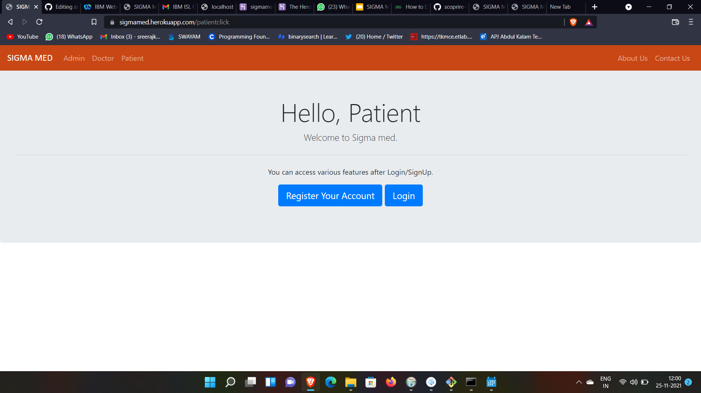

<!-- 

 -->
<h1 align="center">SigmaMed</h1>

Health care 4 u

## Problem Statement
-Develop solutions to assist slot booking in hospitals and private clinics .

-Improvise the existing system of isolation and quarantining of a locality with disease outbreak.

-Develop solutions to reduce the waiting time of patients.

-Develop a solution for live interaction of patients with doctor.

## Presentation
- Presentation : [Google Slides](https://docs.google.com/presentation/d/18JGv7s3clLGG4mIEPbhsLk23n0K3KBJQstVPFUprQHw/edit#slide=id.gfc97311032_2_97).

## How it works ?
-Patient can create and login to an account and can book appointments with the doctors in the nearest hospitals. 

-Patient can view his appointment status and also keep a check on current token number.

-Doctor can access the previous disease history and results and can directly prescribe medicines through his portal. 

-The application looks  for similar symptoms reported in the same locality and can predict and detect the possibility of  disease outbreak.

-AI predicting the possibility of patients disease after analysing the symptoms

## Architecture
### Frontend
  -HTML,CSS
  
### Backend
- Django 
- Heroku 

### Contributors

- Navaneeth C - Frontend
- Abhishek S  - Frontend
- Sreeraj S Kumar - Backend
- Gokul Prakash - Backend
- Abhishek S Kumar - Presentation
-Akshay Suresh - Presentation
-Johnjo Benny -Presentation

## Screenshots

  

 
  

  

 
  

  

 

  

 

  

 
